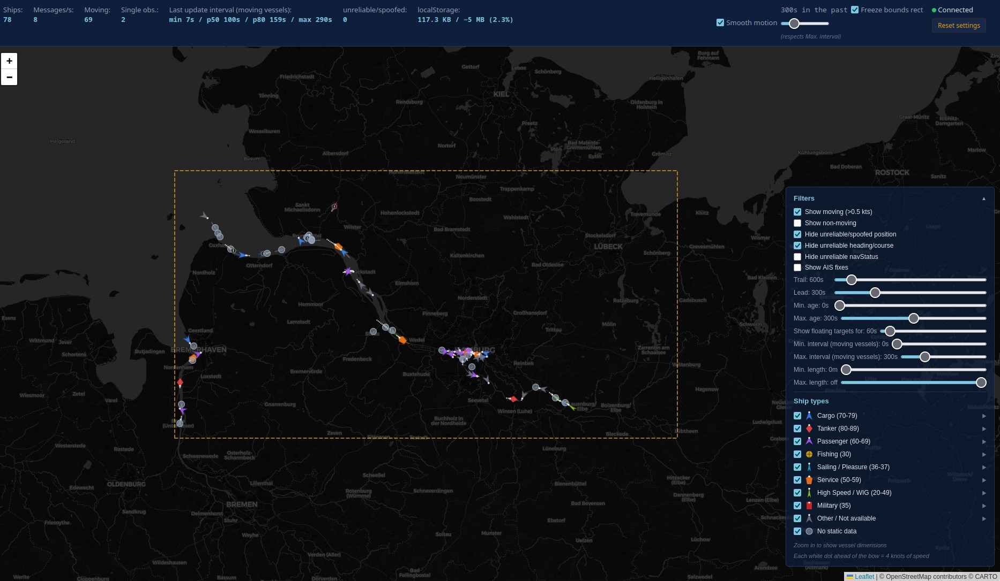
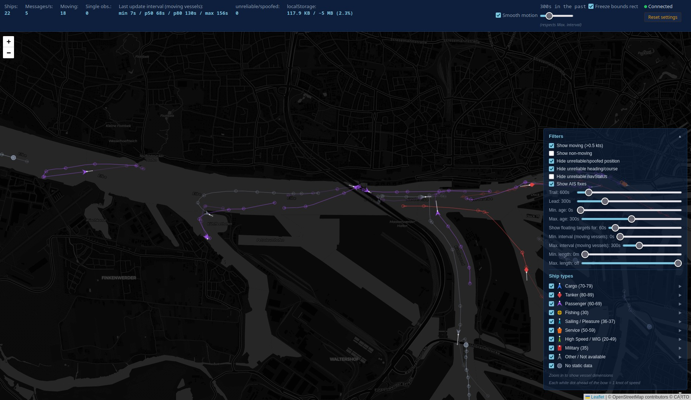
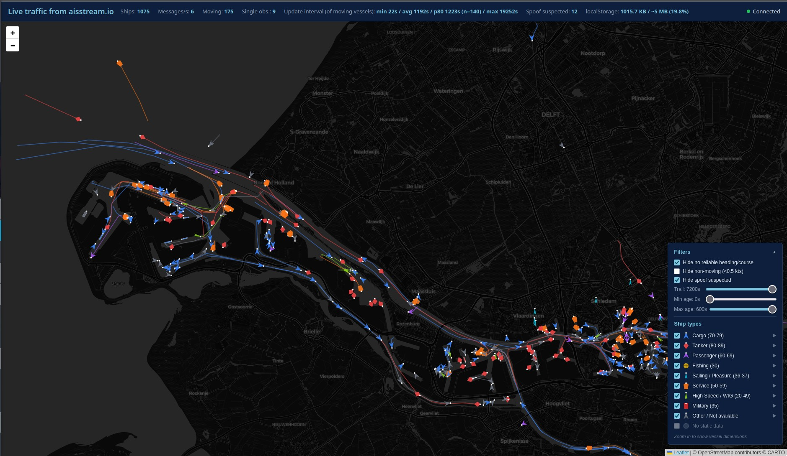
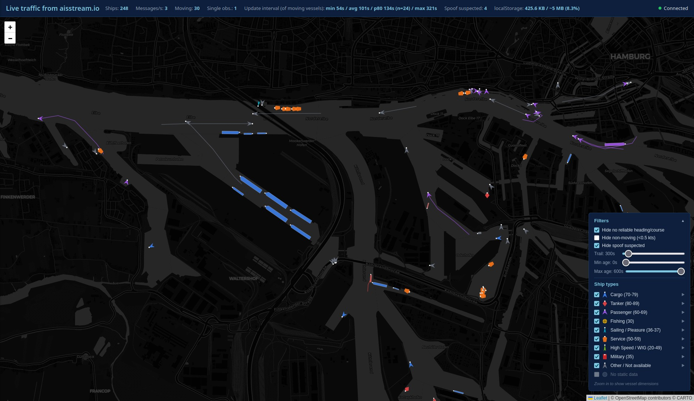
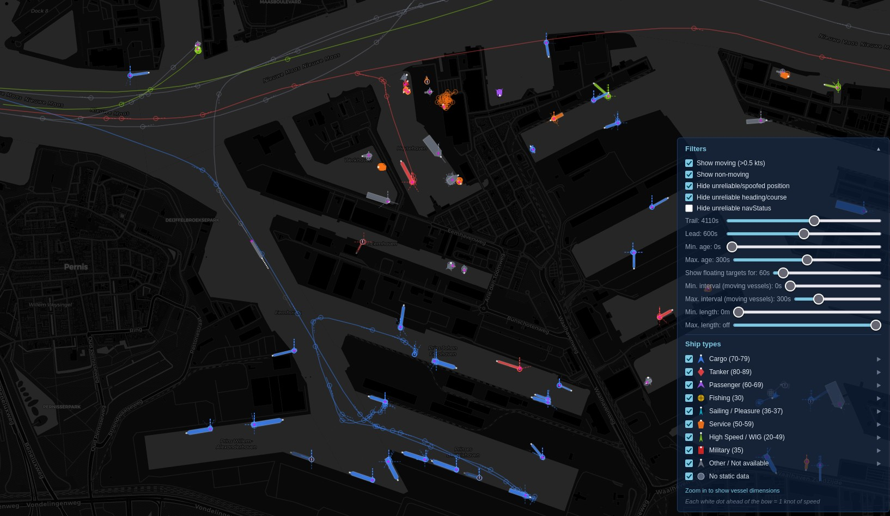

# AIS Stream Live Map

Live AIS ship traffic map powered by [aisstream.io](https://aisstream.io).







## Requirements

- Node.js 18+
- An API key from [aisstream.io](https://aisstream.io)

## Run

```bash
npm install
AIS_API_KEY=your_key_here npm run start
```

Open **http://localhost:3000**.

To use a different port:

```bash
PORT=8080 AIS_API_KEY=your_key_here npm run start
```

## How it works

`server.mjs` proxies the browser to `wss://stream.aisstream.io` (due to CORS):

- Forwards AIS messages to all browser clients via a local WebSocket at `/ws`.
- Updates the bounding box.
- Adds magnetic declination (for true-heading correction), before forwarding.

The frontend (`public/index.html`) renders ships on a Leaflet map, with a legend/filter panel (ship type, speed, age, trail and lead length), basic unreliability detection (implausible implied speed, wrong navStatus), and `localStorage` persistence of recent traffic across reloads.

It has a "smooth motion" feature that moves the vessels along smooth curves through their real AIS positions. This works on past data, so wait some minutes until enough position fixes are received.

## Log file

The server writes a log to **`debug.log`** in the project directory (overwritten on each start), recording connection events, bounding box updates, and every received position/static-data message.
